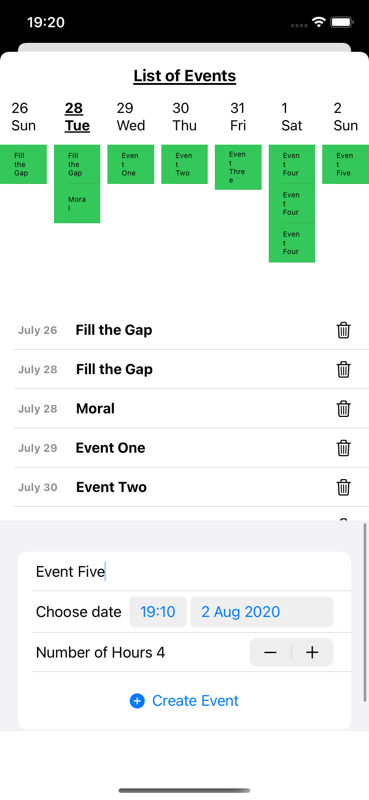

# Why?
Sometimes I forget to schedule my day (or week) to work on technical tasks, check goals, etc. So, I end up having a lot of meetings during the morning (the most productive moment of the day). That's why I started this "project" to reserve time to work on things that help my team

# Example

This demo app is compiling with Xcode 12 beta 3. The app uses Google API to retrieve some information about your calendar and events. You can use it directly (or if you want, you can update the client id, BUT you will have to create a new one in your google developer account).

<!--  -->

## Architecture

I used the Swift Composable Architecture from PointFree. You can check all of their videos [here](https://www.pointfree.co).

## Usage

First, you need to log in with Google. A list of Calendars will appear, and if you tap one of them, you will see all the events in the current week.

## Contributing
Thus it's just a demo to show you how I used this new architecture from PointFree. I'm currently using it in [Readit](https://apps.apple.com/us/app/id1513003417#?platform=iphone)
